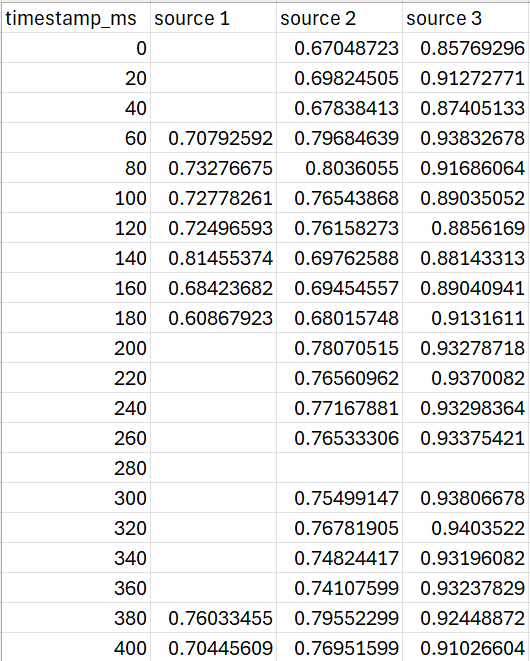

# MAPSS-measures (See [paper](https://arxiv.org/abs/2509.09212v1), [demo](https://huggingface.co/spaces/AIvry/MAPSS-measures))

MAPSS (**Manifold-Aware Perceptual Source Separation**) provides evaluation code for two perceptually grounded, frame-level measures:  
- **Perceptual Separation (PS)** – quantifies how well separated speech sources are perceived. Range: 0-1, higher is better.
- **Perceptual Match (PM)** – quantifies how closely separated signals match reference speech. Range: 0-1, higher is better.

Both measures are implemented with diffusion maps over self-supervised embeddings, and include error bounds per frame and measure.

---

## Installation

### Congifuration
- Python **3.11.x** (tested on 3.11.9)  
- `pip` (latest version recommended)  
- Optional: NVIDIA GPU with drivers supporting **CUDA ≥ 12.4** (tested with driver 12.6)

### Steps

1. **Clone the repository**
   ```bash
   git clone https://github.com/Amir-Ivry/MAPSS-measures
   cd MAPSS-measures
   ```

2. **Create a virtual environment**
   - **Windows (PowerShell):**
     ```powershell
     py -3.11 -m venv .venv
     .\.venv\Scripts\Activate.ps1
     ```
   - **Linux / macOS:**
     ```bash
     python3.11 -m venv .venv
     source .venv/bin/activate
     ```

3. **Upgrade pip and install dependencies**
   ```bash
   python -m pip install --upgrade pip setuptools wheel
   pip install -r requirements.txt
   ```

4. **Install PyTorch**
   - **CPU-only (default):**
     ```bash
     pip install torch==2.6.0 --index-url https://download.pytorch.org/whl/cpu
     ```
   - **GPU build (CUDA 12.4, works with driver 12.6):**
     ```bash
     pip install torch==2.6.0 --index-url https://download.pytorch.org/whl/cu124
     ```

---

## Usage

Experiments are launched via the CLI `main.py`.  
The system supports **JSON** or **Python** manifests to specify mixtures, references, and system outputs.  

### Arguments
- `--manifest` (required): Path to `.json` or `.py` manifest file  
- `--model` (required): Embedding model (`raw`, `wavlm`, `wav2vec2`, `hubert`, `wavlm_base`, `wav2vec2_base`, `hubert_base`, `wav2vec2_xlsr`)  
- `--layer` (optional): Model layer (validated against model-specific limits)  
- `--alpha` (optional): Diffusion map α parameter in `[0,1]` (default from config)  
- `--max-gpus` (optional): Limit GPUs used  
- `--verbose`: Enable detailed logs  

---

## Example

### 1. Download the SASSEC dataset  
Download the [SASSEC](https://www.audiolabs-erlangen.de/content/resources/00_2019-WASPAA-SEBASS/SASSEC.zip) data from the official source.

### 2. Example Python manifest (`Manifests/example_English.py`)
Two mixtures with two speakers in each. In "female_pair_example" we consider two different systems and in "male_pair_example" a single system.
```python
from pathlib import Path

SASSEC_PATH = "C:/postdoc/R1 - PS and PM/Data - speech separation MOS/SASSEC"  # full path

MANIFEST = [
    {
        "mixture_id": "female_pair_example",
        "references": [
            Path(SASSEC_PATH) / Path("Signals/orig/female_inst_sim_1.wav"),
            Path(SASSEC_PATH) / Path("Signals/orig/female_inst_sim_2.wav"),
        ],
        "systems": {
            "Algo1_SASSEC": [
                Path(SASSEC_PATH) / Path("Signals/Algo1/female_inst_sim_1.wav"),
                Path(SASSEC_PATH) / Path("Signals/Algo1/female_inst_sim_2.wav"),
            ],
            "Algo2_SASSEC": [
                Path(SASSEC_PATH) / Path("Signals/Algo2/female_inst_sim_1.wav"),
                Path(SASSEC_PATH) / Path("Signals/Algo2/female_inst_sim_2.wav"),
            ],
        },
    },
    {
        "mixture_id": "male_pair_example",
        "references": [
            Path(SASSEC_PATH) / Path("Signals/orig/male_inst_sim_1.wav"),
            Path(SASSEC_PATH) / Path("Signals/orig/male_inst_sim_2.wav"),
        ],
        "systems": {
            "Algo1_SASSEC": [
                Path(SASSEC_PATH) / Path("Signals/Algo1/male_inst_sim_1.wav"),
                Path(SASSEC_PATH) / Path("Signals/Algo1/male_inst_sim_2.wav"),
            ],
        },
    },
]
```

### 3. Run the experiment
- **Windows (PowerShell):**
  ```powershell
  python main.py --manifest .\Manifests\example_English.py --model wav2vec2 --alpha 1.0 --layer 2 --verbose
  ```
- **Linux / macOS:**
  ```bash
  python main.py --manifest ./Manifests/example_English.py --model wav2vec2 --alpha 1.0 --layer 2 --verbose
  ```

Results and parameters are stored automatically in the `results/` directory.

### 4. Output interpretation
Assume a mixture of three sources. The output of both the PS and PM measures, will take this format:


For every timestamps in milliseconds, every source either has value or is blank. Values of measures appear for active sources, as long as there were at least two. Non-active sources remain blank.

---

## Citing

If you use this work, please cite:

```bibtex
@article{ivry2025mapss,
  title={MAPSS: Manifold-based Assessment of Perceptual Source Separation},
  author={Ivry, Amir and Cornell, Samuele and Watanabe, Shinji},
  journal={arXiv preprint arXiv:2509.09212},
  year={2025}
}

```
MIT License

Copyright (c) 2025 MAPSS contributors

Permission is hereby granted, free of charge, to any person obtaining a copy
of this software and associated documentation files (the "Software"), to deal
in the Software without restriction, including without limitation the rights
to use, copy, modify, merge, publish, distribute, sublicense, and/or sell
copies of the Software, and to permit persons to whom the Software is
furnished to do so, subject to the following conditions:

The above copyright notice and this permission notice shall be included in all
copies or substantial portions of the Software.

THE SOFTWARE IS PROVIDED "AS IS", WITHOUT WARRANTY OF ANY KIND, EXPRESS OR
IMPLIED, INCLUDING BUT NOT LIMITED TO THE WARRANTIES OF MERCHANTABILITY,
FITNESS FOR A PARTICULAR PURPOSE AND NONINFRINGEMENT. IN NO EVENT SHALL THE
AUTHORS OR COPYRIGHT HOLDERS BE LIABLE FOR ANY CLAIM, DAMAGES OR OTHER
LIABILITY, WHETHER IN AN ACTION OF CONTRACT, TORT OR OTHERWISE, ARISING FROM,
OUT OF OR IN CONNECTION WITH THE SOFTWARE OR THE USE OR OTHER DEALINGS IN THE
SOFTWARE.
```
